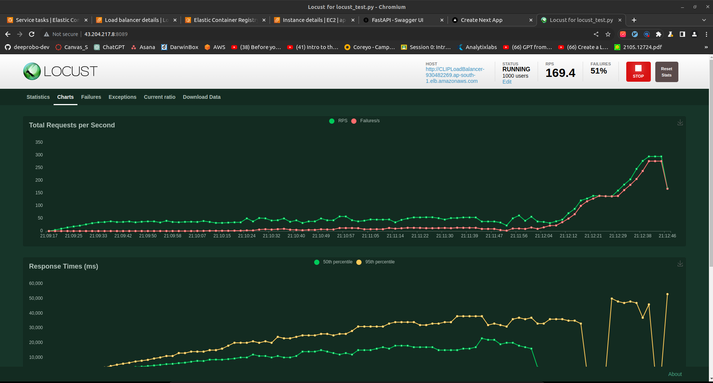

# CLIP model inference with fastAPI along with ECS Deployment and stress Test

This is a simple example of how to use the CLIP model with fastAPI where we can input an image and multiple comma seperated texts and get the similarity score of the image with each text.

## Usage

### Build docker image

```bash
docker build -t clip-fastapi .
```

### Run docker image

```bash
docker run -p 80:80 clip-fastapi
```

### Stress test with locust

```bash
locust -f locust_test.py
```

### Run from postman

```bash
# http://<ip/localhost>:80/image-to-text?text=an image of a dog, image of a cat

# and give multiform data as body and upload image and send post request.
```

## Deployment process in ECS

Please visit this video [link](https://drive.google.com/file/d/1gn7utSRfLSxPsVluW4stxqRb6c4zBdM_/view?usp=sharing) to see the deployment process in AWS ECS along with load balancer and locust stress test.

## Output Screenshots:
Locust Stress Test Results after ecs farget deployment:



